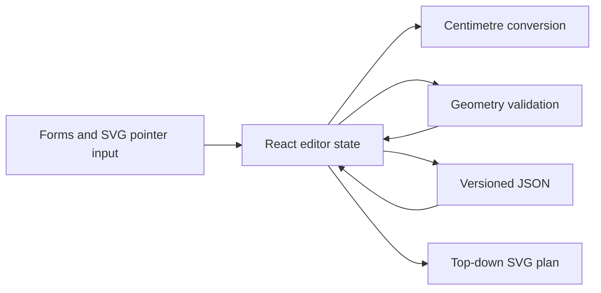

## Architecture

`App.tsx` owns React interaction state and renders the editor. Pure modules
keep geometry, centimetre conversion, and persistence independently testable:

| Module | Responsibility |
| --- | --- |
| `geometry.ts` | Polygon checks, point containment, furniture bounds and collision checks, wall projection, and valid placement search |
| `units.ts` | Centimetre conversion, display formatting, whole-value validation, and 1 cm rounding |
| `layoutPersistence.ts` | Version 2 centimetre serialization, structural validation, and legacy version 1 conversion |

## Data model

The live editor stores geometry in SVG coordinate units for straightforward
distance and polygon calculations. Furniture has a centre coordinate, width,
length, colour, and quarter-turn rotation. An opening contains a host wall
index, centre offset along that wall, size, and door/window kind.

The interaction boundary rounds pointer coordinates to the nearest centimetre.
Forms accept only whole-centimetre dimensions. Version 2 files explicitly use
`units: "cm"` and serialize every user measurement as an integer centimetre.

## Validation and interaction rules

Room validity requires three or more vertices, non-zero area, non-zero wall
lengths, and no intersection between non-adjacent wall segments. Furniture
must have every corner within the polygon. Edge-wall intersections are checked
so a footprint cannot cross a concave boundary; boundary contact is allowed.
Axis-aligned bounding boxes provide the collision check because supported
rotations are quarter turns.

Openings remain valid only when their centre-offset interval fits their host
wall and does not intersect another interval on that wall. All interactive
candidate changes are validated before state replacement, so invalid movement,
rotation, resizing, room edits, and opening edits preserve the last valid
state. The root SVG captures an active pointer, tracks its pointer ID, and
releases capture on completion or cancellation so drags survive label and
canvas-boundary transitions without suppressing text selection in control panels.

## Persistence compatibility

`layoutPersistence.ts` accepts only structurally valid version 2 centimetre
files or recognized legacy version 1 files. Version 2 requires integer
centimetres. Version 1 is normalized to nearest centimetres and then passed
through the same layout validation as a new file. The UI reports the conversion
instead of treating older values as ambiguous new-format data.

## Testing strategy

Vitest targets pure, deterministic behavior rather than rendering internals:
polygon rejection and boundary containment, furniture contact versus overlap,
placement search for multiple pieces, centimetre precision conversion, and
versioned persistence conversion/validation. The app is then type-checked and
bundled by the production build.
